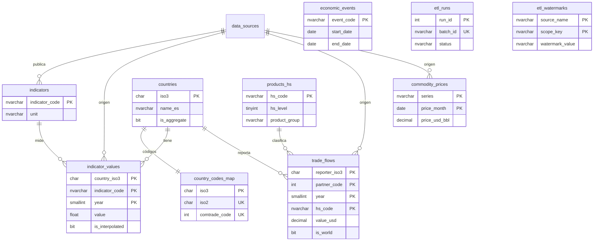
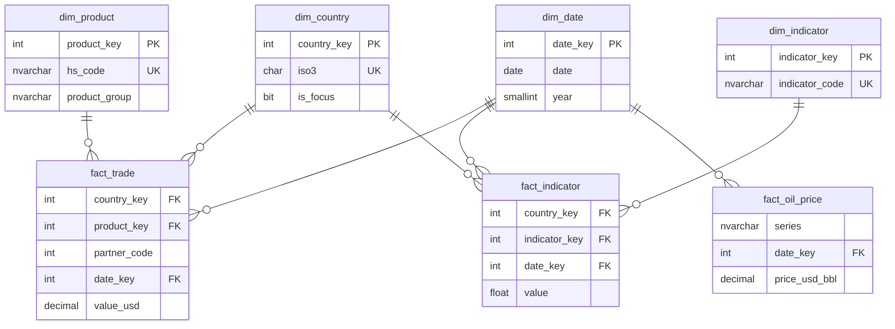

# Diagramas entidad-relación

## silver (3FN)

```mermaid
erDiagram
    data_sources ||--o{ indicators : "publica"
    data_sources ||--o{ indicator_values : "origen"
    data_sources ||--o{ trade_flows : "origen"
    data_sources ||--o{ commodity_prices : "origen"
    countries ||--|| country_codes_map : "códigos"
    countries ||--o{ indicator_values : "tiene"
    countries ||--o{ trade_flows : "reporta"
    indicators ||--o{ indicator_values : "mide"
    products_hs ||--o{ trade_flows : "clasifica"
    countries { char iso3 PK
                nvarchar name_es
                bit is_aggregate }
    country_codes_map { char iso3 PK
                        char iso2 UK
                        int comtrade_code UK }
    indicators { nvarchar indicator_code PK
                 nvarchar unit }
    indicator_values { char country_iso3 PK
                       nvarchar indicator_code PK
                       smallint year PK
                       float value
                       bit is_interpolated }
    products_hs { nvarchar hs_code PK
                  tinyint hs_level
                  nvarchar product_group }
    trade_flows { char reporter_iso3 PK
                  int partner_code PK
                  smallint year PK
                  nvarchar hs_code PK
                  decimal value_usd
                  bit is_world }
    commodity_prices { nvarchar series PK
                       date price_month PK
                       decimal price_usd_bbl }
    economic_events { nvarchar event_code PK
                      date start_date
                      date end_date }
    etl_runs { int run_id PK
               nvarchar batch_id UK
               nvarchar status }
    etl_watermarks { nvarchar source_name PK
                     nvarchar scope_key PK
                     nvarchar watermark_value }
```

## gold (estrella)

```mermaid
erDiagram
    dim_date ||--o{ fact_trade : ""
    dim_date ||--o{ fact_indicator : ""
    dim_date ||--o{ fact_oil_price : ""
    dim_country ||--o{ fact_trade : ""
    dim_country ||--o{ fact_indicator : ""
    dim_product ||--o{ fact_trade : ""
    dim_indicator ||--o{ fact_indicator : ""
    dim_date { int date_key PK
               date date
               smallint year }
    dim_country { int country_key PK
                  char iso3 UK
                  bit is_focus }
    dim_product { int product_key PK
                  nvarchar hs_code UK
                  nvarchar product_group }
    dim_indicator { int indicator_key PK
                    nvarchar indicator_code UK }
    fact_trade { int country_key FK
                 int product_key FK
                 int partner_code
                 int date_key FK
                 decimal value_usd }
    fact_indicator { int country_key FK
                     int indicator_key FK
                     int date_key FK
                     float value }
    fact_oil_price { nvarchar series
                     int date_key FK
                     decimal price_usd_bbl }
```
